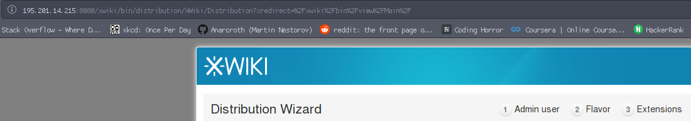
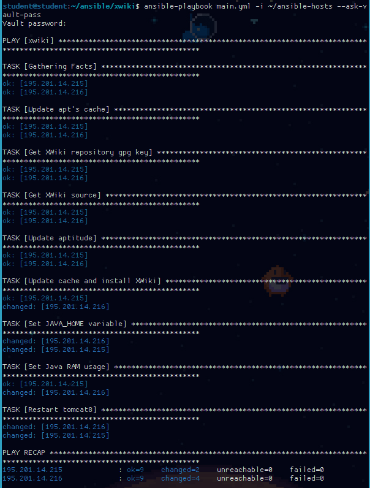

# DevOps Project


---

These are the steps and tasks I did over the course of the DevOps course.

## Overview

The main tasks that were done, were continual repetitions of all of the practices and shared in class tutorials!

There is a *daily* `cron` job that takes a **snapshot** of the containers with the current date as an *id* of each snapshot. The snapshots are then *backed-up* with the `ZFS` file-system. The backed-up `.raw` files are then transoprted to my personal computer (this step is not automated since my computer is not up 24/7).

Shell scripts for the server-side backups and server to client can be seen under `backup.sh` and `backup_raw.sh`.

## Ansible Playbook

The plaubook I wrote try to be as *indempotent* as possible. Here the [Ansible Documentation](http://docs.ansible.com) came in real handy, since every module was clearly explained.

The `XWiki`'s are installed via a compact distribution, that contains all of the `tomcat8` and `pgsql` dependecies.

*Step0* - was to go over the [XWiki Installation](http://www.xwiki.org/xwiki/bin/view/Documentation/AdminGuide/Installation/) page and manually install one such `XWiki` on one server. Using the `.deb` package, this was relatively easy.

*Step1* - was to create a basic *one-time* shell script (`install_xwiki.sh`) that would do the job on a basic setup.

*Step2* - was to go by intuition and re-write the script line-by-line into an `ansible` playbook. In reality this turned out better than expected. It worked. 

*Step3* - was to fix all of the mistakes, warnings, and unnecessary code from the playbook. This made it more in the spirit of `ansible` and also I got the chance to spend some time with their documentation. 

## Bonus(es)

These are just things that I have additionally setup, in order to create a more secure server.

- My account on the server has root privileges, whith the root password is disabled. (duh)
- `iptables` have been configured so that only a small set of `ip` addresses can access the server via `ssh`.
- Connection to the server is only done through `ssh`.
- I have non-local (not on the server) backups of the containers.

## Fixes

One of the issues that continually persisted along my development was that darn `ansible` error, that couldn't reach one of my containers through `ssh`, regardless of the fact that I was able to `ssh` over to the container itself.

``` bash
195.201.14.216 | UNREACHABLE! => {
    "changed": false, 
    "msg": "SSH Error: data could not be sent to remote host \"195.201.14.216\". Make sure this host can be reached over ssh", 
    "unreachable": true
}
```

After looking onver some issues on **GitHub**, I saw that others had something similar to me. The fix is this - in the `ansible-hosts` file, next to the address of the problematic container, I had to write

``` bash
[server]
xxxx.xxxx.xxxx.xxxx ansible_user=username_of_container ansible_connection=ssh
```

I would guess that ansible didn't recognize/connect to the correct username over `ssh`, which caused it to spit out that error. Other possible fixes include adding the command `-c paramiko` to the `playbook` when run, *downgrading* ansible, configuring `ssh` in the `[ssh_connection]` block of the hosts file, and many more. The full issue thread can be seen [here](https://github.com/ansible/ansible/issues/15321).

## End Result

Here is how the 2 `XWiki` server look like after a proper installation through ansible passes.

 

And here is the clean output from the `playbook`.


